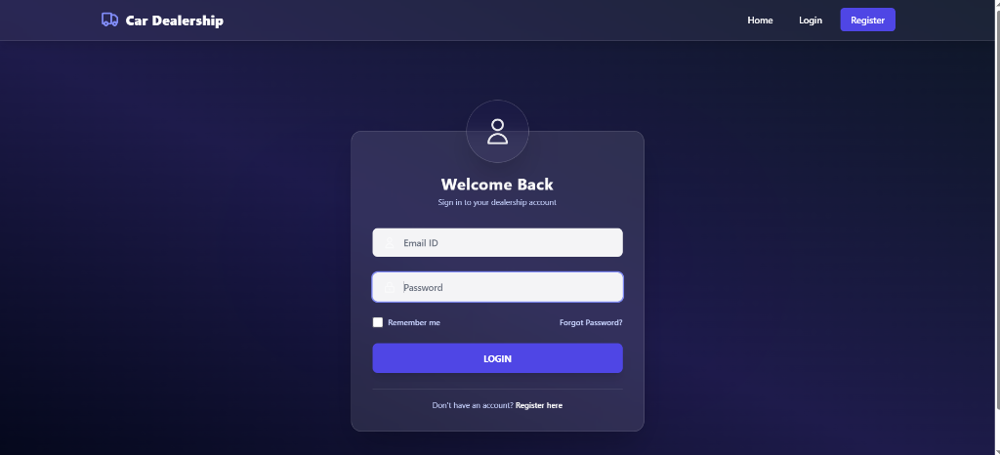
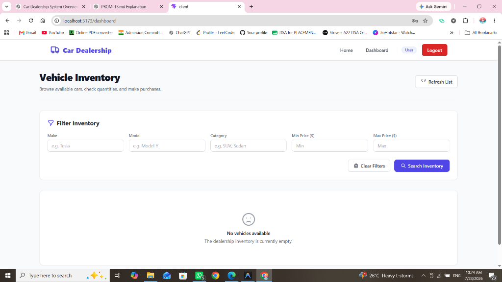
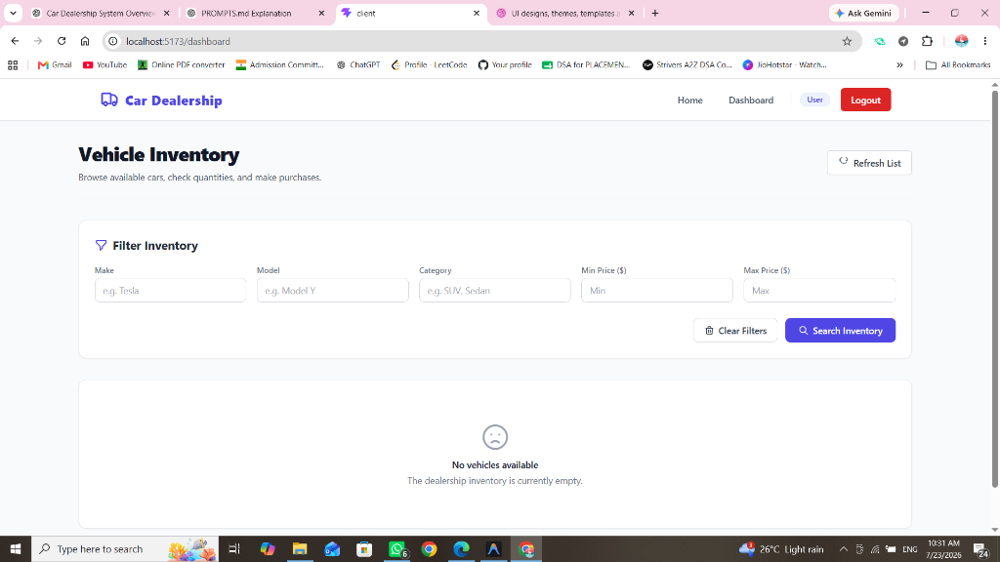
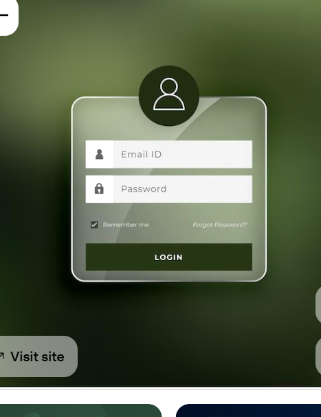

# Car Dealership Inventory System

## Project Overview
The Car Dealership Inventory System is a full-stack web application designed to manage vehicle stocks and purchases using a test-driven development (TDD) approach. It features a modern, responsive user interface styled with a premium glassmorphic dark theme. Standard authenticated users can search, filter, and purchase vehicles (reducing inventory count in real-time), while authorized administrators can add, update, delete, and restock vehicle inventory models directly from a secure control panel dashboard.

---

## Setup Instructions

A stranger can clone this repository and run the application locally by following these setup steps:

### 1. Prerequisites
- **Node.js** (v18 or higher recommended)
- **MongoDB** instance (local or remote MongoDB Atlas connection string)

### 2. Backend (Server) Setup
1. Open your terminal and navigate to the server folder:
   ```bash
   cd server
   ```
2. Install the server dependencies:
   ```bash
   npm install
   ```
3. Create a `.env` file in the root of the `server/` directory and configure the following environment variables:
   ```env
   PORT=5000
   MONGO_URI=your_mongodb_connection_uri
   JWT_SECRET=your_jwt_signing_secret_key
   ```
4. Start the backend server in development mode:
   ```bash
   npm run dev
   ```

*(Optional)* To seed a default admin user account (`admin@dealership.com` / `admin123`) to log in directly, run:
```bash
node seedAdmin.js
```

### 3. Frontend (Client) Setup
1. Open a new terminal window and navigate to the client folder:
   ```bash
   cd client
   ```
2. Install the client dependencies:
   ```bash
   npm install
   ```
3. Create a `.env` file in the root of the `client/` directory and set the API backend URL:
   ```env
   VITE_API_URL=http://localhost:5000/api
   ```
4. Start the frontend development server:
   ```bash
   npm run dev
   ```
5. Open your browser and navigate to `http://localhost:5173`.

---

## API Endpoint List

The backend exposes 9 primary endpoints mounted under `/api`:

| Method | Path | Description | Access Level |
|---|---|---|---|
| **POST** | `/api/auth/register` | Registers a new user. Expects `email`, `password`, and optional `role` ('user' or 'admin') in request body. | Public |
| **POST** | `/api/auth/login` | Authenticates user credentials. Returns a JWT token. | Public |
| **GET** | `/api/vehicles` | Retrieves the list of all available vehicles in inventory. | Authenticated Users |
| **GET** | `/api/vehicles/search` | Filters vehicles based on make, model, category, minimum price, or maximum price query parameters. | Authenticated Users |
| **POST** | `/api/vehicles` | Adds a new vehicle model to the inventory catalog. | Authenticated Users |
| **PUT** | `/api/vehicles/:id` | Updates attributes of a specific vehicle using its unique ID parameter. | Authenticated Users |
| **DELETE** | `/api/vehicles/:id` | Deletes a vehicle from the system entirely. | Administrator Only |
| **POST** | `/api/vehicles/:id/purchase` | Decrements the stock quantity of the specified vehicle by 1. Throws an error if out of stock. | Authenticated Users |
| **POST** | `/api/vehicles/:id/restock` | Replenishes stock quantity. Expects `quantity` parameter in request body. | Administrator Only |

---

## Screenshots

Below are screenshots demonstrating the application's user interface design and layout flows:

### 1. Login Screen
*Premium glassmorphism card over a dark gradient background mesh featuring user-input fields.*  


### 2. Vehicle Dashboard
*User-facing inventory dashboard showing the vehicle search filters and reactive card catalog grid.*  


### 3. Search & Filters
*Search filters in action limiting the available inventory dynamically to matched query criteria.*  


### 4. Admin Panel
*Administrative panel containing inventory statistics metrics, structured tabular vehicle listing, and CRUD actions.*  


---

## Test Report Summary

The backend utilizes Jest and Supertest to verify authentication, privilege scopes, and service-layer business rules.

* **Total Test Cases:** 41 passed / 41 total
* **Test Suites:** 11 passed / 11 total
* **Success Rate:** 100%
* **Code Coverage:**
  - **Statements:** 93.39%
  - **Branches:** 92.13%
  - **Functions:** 95.23%
  - **Lines:** 93.39%

For a complete breakdown of integration paths and mock validations, refer to the full [TESTREPORT.md](testreport.md).

---

## My AI Usage

### Tools Used
- **Antigravity** (AI Pair Programming Assistant)
- **Gemini 3.5 Flash** (Medium model)

*Refer to the full prompts and responses record inside [PROMPTS.md](Prompt.md).*
